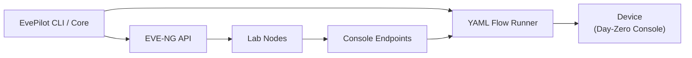

# EvePilot


**Flow-driven automation for EVE-NG labs.**

EvePilot helps network engineers, NetDevOps practitioners, and certification
candidates automate EVE-NG lab discovery and day-zero console preparation.

It discovers lab nodes through the EVE-NG API, extracts console endpoints, and
runs state-aware preparation flows before SSH or management access exists.

> EvePilot is in early development. Current focus: EVE-NG node discovery and
> flow-driven console preparation.

## ✨ Capabilities

- Authenticate to the EVE-NG API.
- List nodes in an EVE-NG lab.
- Get a node by name and return its console endpoint.
- Run flow-driven console preparation from YAML.
- Use Telnet or raw TCP console transport.
- List, show, and export built-in bootstrap flows.
- Return structured JSON for scripts and automation tools.

## ✅ Prerequisites

- Python 3.11 or later.
- A running EVE-NG instance.
- Network access from your workstation to the EVE-NG API.
- Console port access from your workstation, unless a future SSH-forwarded
  transport is used.

## 🚀 Quickstart

Install EvePilot in editable mode from the repository:

```bash
git clone https://github.com/milad-naderpour/evepilot.git
cd evepilot
python -m venv .venv
source .venv/bin/activate
pip install -e packages/evepilot-core
pip install -e packages/evepilot-eve-ng
pip install -e packages/evepilot-bootstrap
pip install -e apps/cli
```

On Windows, activate the virtual environment with:

```powershell
.venv\Scripts\activate
```

> Multi-package install is explicit for now. A workspace installer
> (`pip install -e ".[all]"`) is planned.

Configure EVE-NG access:

```bash
export EVEPILOT_EVE_NG_URL=http://10.1.2.3
export EVEPILOT_EVE_NG_USERNAME=admin
export EVEPILOT_EVE_NG_PASSWORD=eve
```

List nodes in a lab:

```bash
evepilot nodes all --lab EIGRP/Basics.unl
```

Get one node and its console endpoint:

```bash
evepilot nodes get --lab EIGRP/Basics.unl --node CSR-1
```

List built-in preparation flows:

```bash
evepilot bootstrap flow list
```

Prepare a router console:

```bash
evepilot bootstrap prepare \
  --lab EIGRP/Basics.unl \
  --node CSR-1 \
  --flow built-in:cisco-router-first-boot
```

For slow first-boot images, increase the detection timeout:

```bash
evepilot bootstrap prepare \
  --lab EIGRP/Basics.unl \
  --node C8000V-1 \
  --timeout 240
```

For full setup details, see:

- [Installation](docs/installation.md)
- [Quickstart](docs/quickstart.md)
- [Configuration](docs/configuration.md)

## 🧠 Why EvePilot?

EVE-NG is powerful, but first-boot lab automation still tends to start with
manual console work: finding dynamic ports, opening consoles one by one, and
answering setup prompts before SSH exists.

EvePilot turns that fragile day-zero phase into a repeatable flow. It uses the
EVE-NG API as the source of truth, connects to the discovered console endpoint,
and runs explicit YAML preparation steps that can be inspected, exported, and
customized.

The result is a lab workflow that is easier to repeat for practice, demos,
testing, and future CI/CD automation.

## 🧩 Architecture



Preparation flows are YAML files. A flow defines console states, prompt markers,
and actions such as sending `no`, pressing Return, entering enable mode, or
waiting for a prompt.

Built-in flows can be inspected and exported:

```bash
evepilot bootstrap flow show built-in:cisco-router-first-boot
evepilot bootstrap flow export \
  built-in:cisco-router-first-boot \
  --output flows/cisco-router-first-boot.yaml
```

## 📦 Project Structure

```text
EvePilot/
|-- apps/
|   `-- cli/
|-- packages/
|   |-- evepilot-core/
|   |-- evepilot-eve-ng/
|   `-- evepilot-bootstrap/
|-- docs/
|-- tests/
|-- README.md
`-- pyproject.toml
```

## 🗺️ Roadmap

Current work:

- EVE-NG node discovery.
- Console endpoint parsing.
- Flow-driven console preparation.
- Built-in flow inspection and export.

Planned next areas:

- Simple bootstrap command files.
- Multi-stage bootstrap workflows with reload support.
- Lab lifecycle operations.
- API service and web UI.
- Monitoring and CI/CD integrations.

See the full [roadmap](docs/roadmap.md).

## 📚 Documentation

- [Vision](docs/vision.md)
- [Roadmap](docs/roadmap.md)
- [Architecture overview](docs/architecture/overview.md)
- [Project guidelines](docs/project-guidelines.md)
- [Architecture decisions](docs/decisions/README.md)
- [EVE-NG API research](docs/research/eve-ng-api.md)
- [Console discovery research](docs/research/console-discovery.md)

## 🤝 Contributing

Contributions are welcome while the project is still taking shape. Please read
the [contribution guide](CONTRIBUTING.md) before opening a pull request.

## 🔐 Security

EvePilot handles lab credentials and console sessions. Do not commit real
credentials, `.env` files, or private lab details. See the
[security policy](SECURITY.md).

## 📄 License

This project is licensed under the [Apache License 2.0](LICENSE).

## ⚠️ Disclaimer

EvePilot is an independent project and is not affiliated with, endorsed by, or
sponsored by EVE-NG or any vendor.

Use it carefully in lab environments. Always validate automation before applying
it to important systems.
